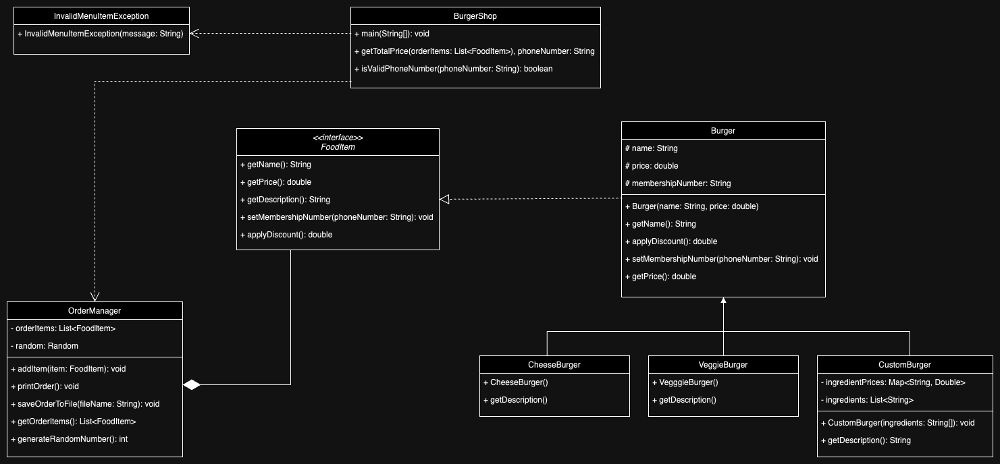

# Project-by-BurgerShop

## Topic: Burger Shop

**Group Member:**
1. 6631503004		Kanyanat Sawatdiwong		section 1  
2. 6631503028		Parichat Sriagsorn 			section 1  
3. 6631503029		Phorn Potjanasuj			section 1  
4. 6631503030		Phichayathida Laeae		    section 1  
5. 6631503032		Patcha Kantaradusadee		section 1  

**Background and rationale:** Traditional burger shops are facing challenges in efficiently managing orders, offering customization options, and enhancing customer satisfaction. Additionally, the covid-19 pandemic made people aware of the importance of contactless ordering and delivery services. Our Burger Shop project aims to address key objectives:
1. Efficient ordering process: Customers can easily browse menu items, and custom their burgers.
2. Customization options: Customers can choose a variety of ingredients.
3. Enhanced customer experience: Repeat customers can enjoy a seamless ordering experience.

## List of functions:
1. Display burger menu, custom menu including burger name and price.
2. Select item, and when select custom menu, user can select their ingredients for the burger.
3. Update the ordered items.
4. Print order to review the selected menus and price before checking out.
5. Save order to files
6. Ask for membership, and offer discount if the user own a membership
7. User receive a receipt for their order.  

